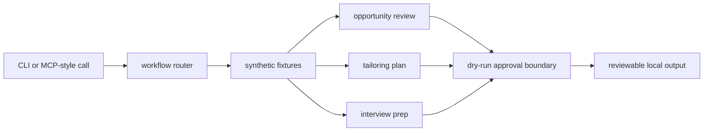

# Portfolio Proof Notes

This page gives reviewers a fast path through the public-safe career workflow patterns in `open-career-mcp`.

## What This Proves

- Career automation workflows can be demonstrated with synthetic fixtures instead of live applicant data.
- Resume tailoring, opportunity review, and interview prep can stay dry-run by default.
- Approval boundaries can be explicit in tool outputs before any external action exists.
- MCP-style manifests can describe workflow tools without connecting to Gmail, LinkedIn, calendars, browsers, or ATS systems.

## Architecture Diagram



## Five-Minute Reviewer Path

```bash
git clone https://github.com/hairglasses/open-career-mcp.git
cd open-career-mcp
make ci
go run ./cmd/open-career-mcp opportunities list
go run ./cmd/open-career-mcp mcp call open_career_tailor_resume --param opportunity_id=syn-001
```

Then inspect `docs/EXAMPLES.md`, `docs/ARCHITECTURE.md`, and `PUBLIC_BOUNDARY.md`.

## Walkthrough Or Demo Plan

1. List synthetic opportunities.
2. Generate a tailoring plan for `syn-001`.
3. Generate interview prep from the same fixture.
4. Show the MCP-style manifest and a tool call.
5. Point out that no live account connector, browser, calendar, or submit path exists.

## Trust Boundary

Included public state: synthetic companies, synthetic opportunities, synthetic resume snippets, dry-run plans, and review-only outputs.

Excluded private state: live job search data, recruiter messages, application records, resumes with personal details, OAuth state, browser state, calendars, Gmail, LinkedIn, Simplify, ATS connectors, and tenant data.

## Tradeoffs

- The repo uses synthetic fixtures instead of real job records. That preserves privacy while still showing workflow design.
- The sample stops at dry-run plans. That makes the approval boundary visible and avoids implying live submission support.
- The tool surface is intentionally narrow, so reviewers can inspect every path quickly.

## Interview Deep-Dive Prompts

- How would you separate recommendation, review, and submission responsibilities in a live career workflow?
- Which fields must be synthetic before a public fixture is safe?
- How should a tool result communicate that user approval is required before an external action?
